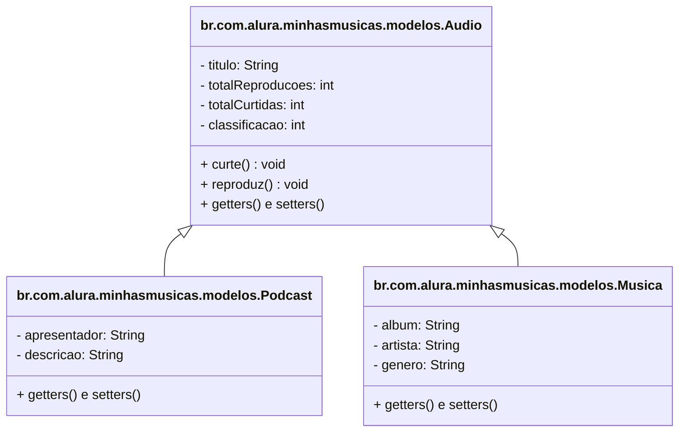

```mermaid

classDiagram
    class br.com.alura.minhasmusicas.modelos.Audio {
        - titulo: String
        - totalReproducoes: int
        - totalCurtidas: int
        - classificacao: int
        + curte() void
        + reproduz() void
        + getters() e setters()
    }
    
    class br.com.alura.minhasmusicas.modelos.Podcast {
        - apresentador: String
        - descricao: String
        + getters() e setters()
    }
    
    class br.com.alura.minhasmusicas.modelos.Musica {
        - album: String
        - artista: String
        - genero: String
        + getters() e setters()
    }
    
    br.com.alura.minhasmusicas.modelos.Audio <|-- br.com.alura.minhasmusicas.modelos.Podcast
    br.com.alura.minhasmusicas.modelos.Audio <|-- br.com.alura.minhasmusicas.modelos.Musica
```