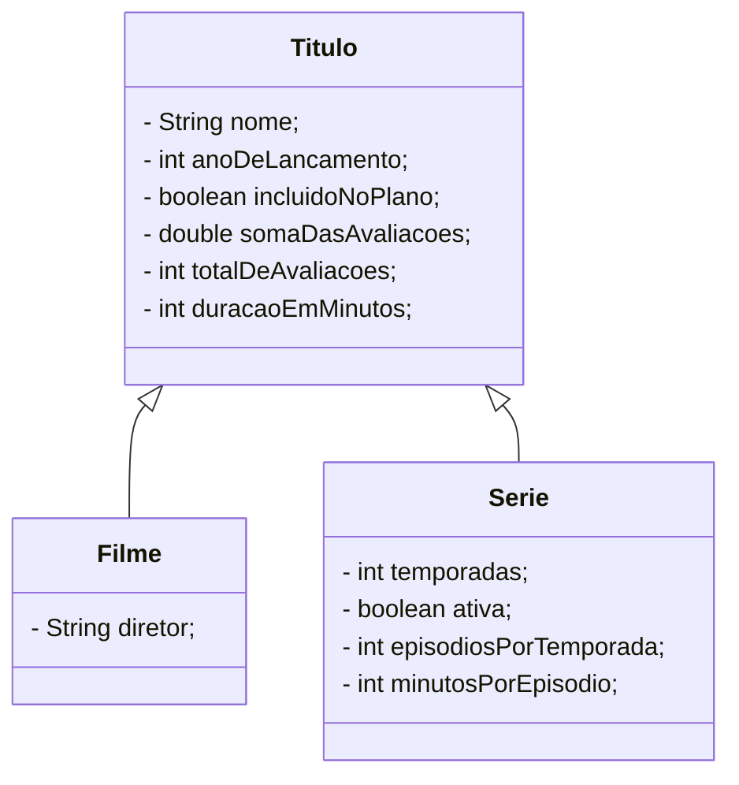

```mermaid

classDiagram
    class Titulo {
        - String nome;
        - int anoDeLancamento;
        - boolean incluidoNoPlano;
        - double somaDasAvaliacoes;
        - int totalDeAvaliacoes;
        - int duracaoEmMinutos;
    }
    
    class Filme {
        - String diretor;
    }
    
    class Serie {
        - int temporadas;
        - boolean ativa;
        - int episodiosPorTemporada;
        - int minutosPorEpisodio;

    }
    
    Titulo <|-- Filme
    Titulo <|-- Serie
```